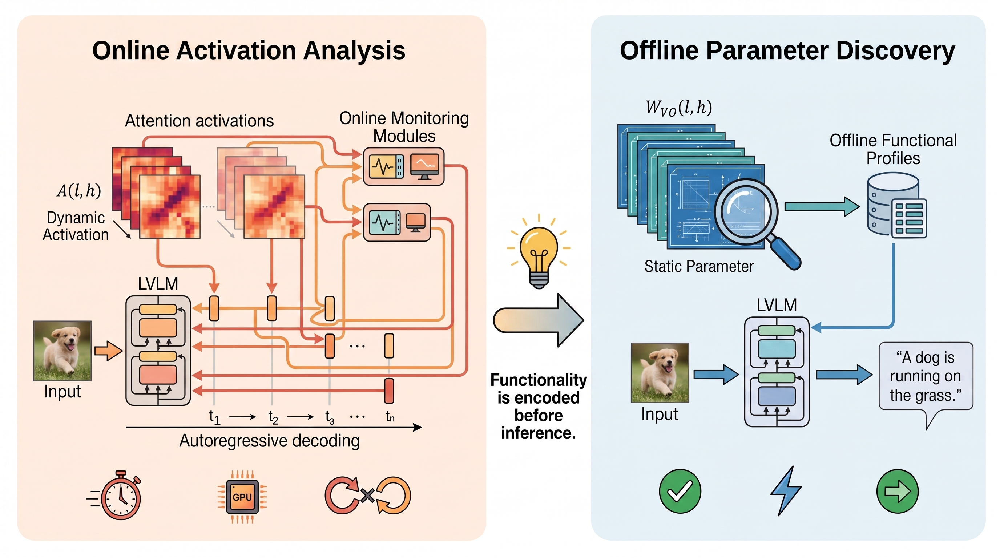

# MPAC: Cross-modal Head Taxonomy & Parameter-space Calibration for LVLM Hallucination Mitigation

Official repository for **"Cross-modal Head Taxonomy: A Parameter-space Calibration for LVLM Hallucination Mitigation"**.

---

## 📌 Overview

Large Vision-Language Models (LVLMs) are susceptible to object hallucination, where generated text deviates from or contradicts physical visual evidence. Existing mitigation strategies largely rely on online activation analysis or expensive alignment training, introducing substantial computational latency during inference. 

In this work, we propose a different paradigm of **parameter-space functional discovery**, demonstrating that the routing mechanisms governing visual grounding and language priors are encoded within the static parameters of attention heads, enabling offline discovery and subsequent zero-overhead online reuse.

### 🌟 Paradigm Comparison
Our approach shifts the focus of hallucination mitigation from active, heavy online tracking of dynamic activations (which incurs high latency) to one-time offline profiling of static parameters, facilitating zero-overhead online calibration in a single forward pass.

<p align="center">
  
</p>

---

## 🛠️ Method: Cross-modal Head Taxonomy & MPAC

By projecting the static joint value-output projection matrices $W_{VO}$ of attention heads into aligned conceptual spaces, we systematically classify heads into four distinct functional categories:
1. **Identity Copying Heads (ICH)**: Propagate historical textual contexts.
2. **Visual Translation Heads (VTH)**: Map visual tokens directly to their textual equivalents (the anchor for visual grounding).
3. **Semantic Association Heads (SAH)**: Trigger text-to-text transitions based on statistical linguistic priors.
4. **Visual Semantic Association Heads (VSAH)**: Produce prior-driven visual-to-textual associations lacking direct visual grounding.

This taxonomy uncovers three core structural laws inside LVLMs:
* **Multimodal Duality**: A strong parameter-space correlation between textual copying (ICH) and visual translation (VTH).
* **Layer-wise Division of Labor**: Middle layers transition sequentially from factual grounding to associative reasoning, while deep layers act as a final competitive gateway.
* **Attention Entropy Resolution**: Grounded reasoning exhibits distributed, high-entropy attention, whereas hallucinations stem from overfocused, low-entropy routing.

<p align="center">
  
</p>

Based on these discoveries, we develop **Multimodal Parameter-space Attention Calibration (MPAC)**, which dynamically scales up grounded propagators (VTH/ICH) and penalizes associative generators (VSAH/SAH) on-the-fly during autoregressive decoding, achieving state-of-the-art mitigation with a single forward pass and negligible latency.

---

## 📂 Repository Structure

The directory tree of this repository is organized as follows:

```text
MPAC/
├── data/                       # Directory containing evaluation datasets
│   ├── coco/                   # MS COCO image dataset
│   ├── coco_annotations/       # Annotation JSONs for COCO evaluations
│   ├── images/                 # Reference images for concept dictionary
│   ├── MME/                    # MME benchmark datasets
│   ├── pope/                   # POPE evaluation configurations
│   ├── coco_config.json        # Unified concept configuration
│   └── conflict_triplets.json  # Reference triplets for evaluation
├── models/                     # Cache directory for target model weights
│   └── llava-1.5-7b-hf/        # LLaVA 1.5 7B HuggingFace checkpoint
├── results/                    # Output directory for experimental logs and results
├── src/                        # Core source code of the project
│   ├── chair_eval/             # Utility scripts for CHAIR metrics calculation
│   ├── plot/                   # Diagnostic plotting and visualization scripts
│   │   ├── find_opposing_heads.py   # Statistical category count & top polar heads
│   │   ├── plot_layer_ridge.py      # Generates layer-wise ridgeline density plot
│   │   ├── plot_attention_entropy.py # Generates attention entropy distributions
│   │   └── plot_polarity_scatter.py  # Generates 2D polarity state-space mapping
│   ├── chair_eval_result.sh    # Script to evaluate and compute CHAIR metric
│   ├── eval_chair_adaptive.py  # CHAIR evaluation using MPAC calibration
│   ├── eval_chair_baseline.py  # CHAIR evaluation using baseline decoding
│   ├── eval_mme_adaptive.py    # MME evaluation using MPAC calibration
│   ├── eval_mme_baseline.py    # MME evaluation using baseline decoding
│   └── ...
├── chair.pkl                   # Pre-computed CHAIR parsing assets
├── requirements.txt            # Required python package dependencies
├── pattern.sh                  # Execution shell script for pattern diagnostics
├── run_mme.sh                  # Run script for MPAC calibration on MME
└── run_mme_baseline.sh         # Run script for Baseline decoding on MME
```

---

## 🚀 Getting Started

### 1. Installation
Clone this repository and install the required dependencies:
```bash
git clone https://github.com/ker33/MPAC.git
cd MPAC
pip install -r requirements.txt
```

### 2. Dataset and Model Preparation
* Place the target model weights (e.g., LLaVA-1.5-7B) inside `models/llava-1.5-7b-hf/`.
* Prepare evaluation datasets (COCO, MME, POPE) under the corresponding subdirectories inside the `data/` folder.

### 3. Running Diagnostics & Plotting
To reproduce our cross-modal parameter-space profiling and generate diagnostic plots:
```bash
# 1. Output category statistics and top 10 strongest polarity attention heads:
python src/plot/find_opposing_heads.py

# 2. Generate the layer-wise division of labor ridgeline density plot:
python src/plot/plot_layer_ridge.py

# 3. Plot the 2D polarity state-space mapping of attention heads:
python src/plot/plot_polarity_scatter.py
```

### 4. Running Evaluations
To evaluate model performance under baseline decoding versus our MPAC calibration:

* **MME Evaluation**:
  ```bash
  # Run baseline decoding on MME:
  bash run_mme_baseline.sh
  
  # Run MPAC calibration on MME:
  bash run_mme.sh
  ```
  
* **CHAIR Evaluation**:
  ```bash
  # Execute CHAIR metrics evaluation:
  bash src/chair_eval_result.sh
  ```

---
